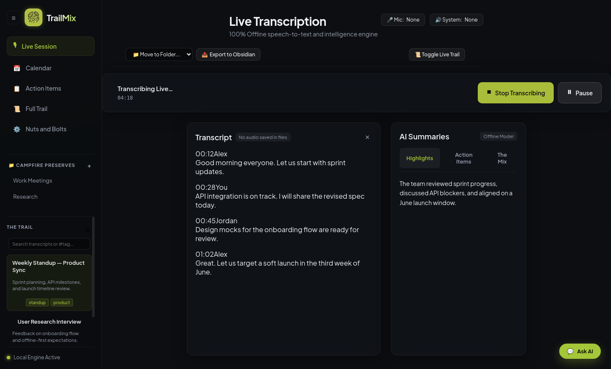
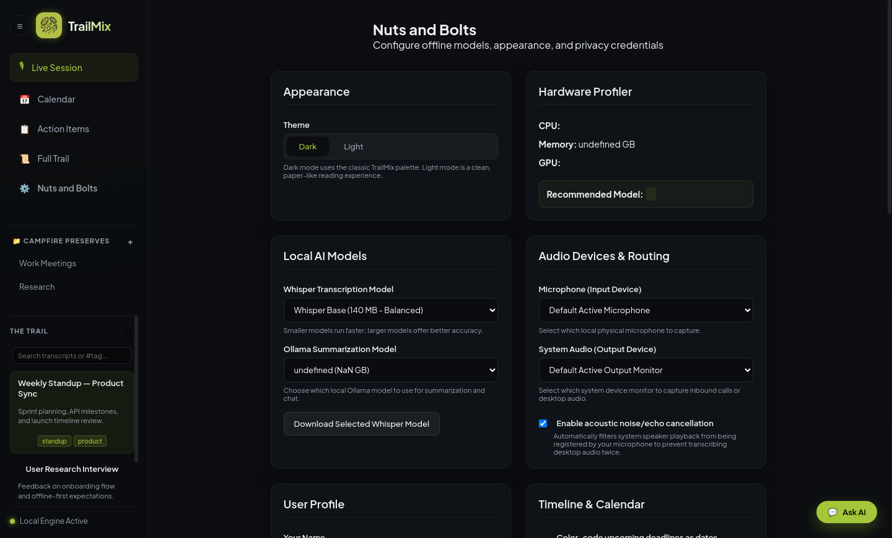
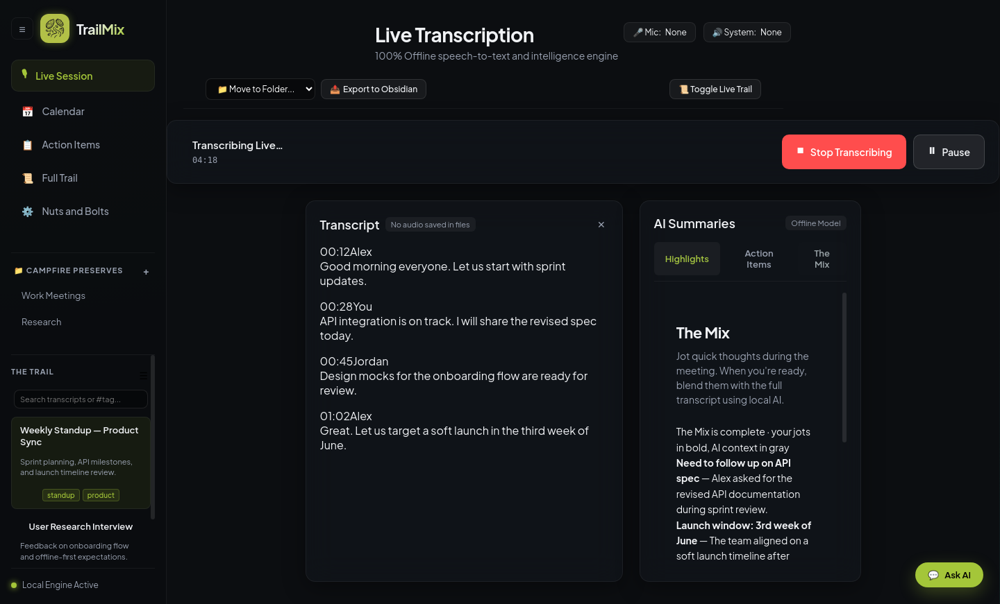
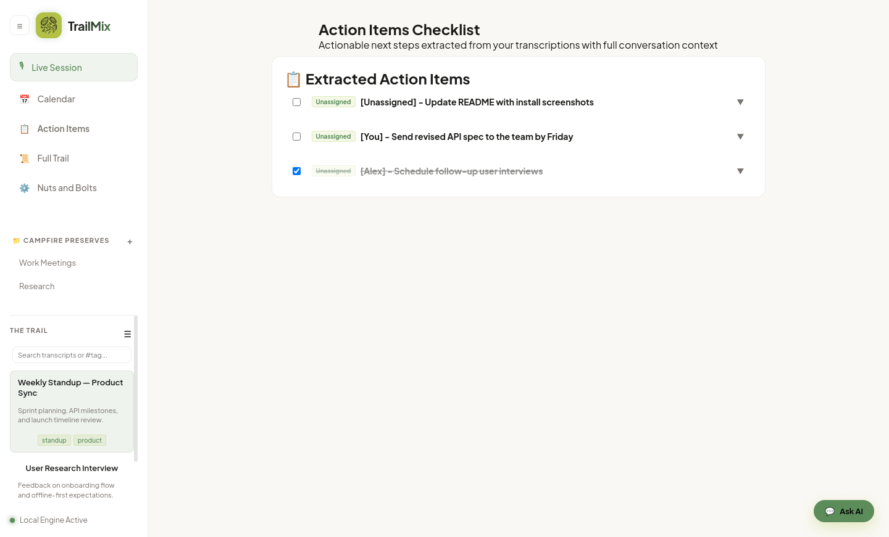
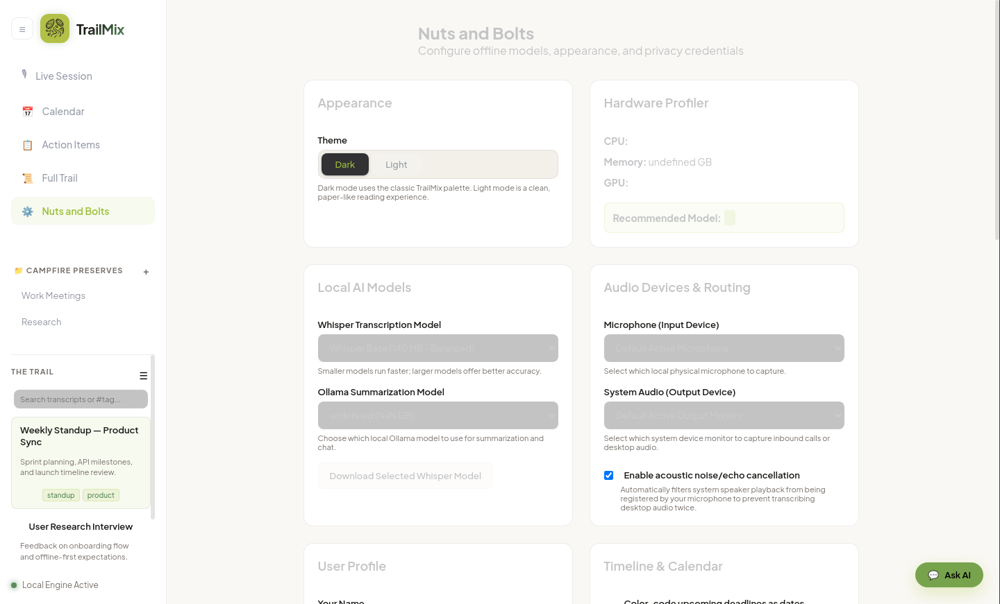

<p align="center">
  
</p>

<h1 align="center">TrailMix</h1>

<p align="center">
  <strong>Local-first AI note-taking and live transcription for Linux</strong>
</p>

<p align="center">
  Capture meetings offline · Jot notes · Blend with AI · Keep everything on your machine
</p>

---

TrailMix records system audio and your microphone, transcribes speech locally with [whisper.cpp](https://github.com/ggerganov/whisper.cpp), and enriches your notes with a local LLM through [Ollama](https://ollama.com). No cloud APIs. No account required.

<p align="center">
  
</p>

---

## Table of contents

- [Features](#features)
- [Requirements](#requirements)
- [Installation guide](#installation-guide)
- [First launch setup](#first-launch-setup)
- [How to use TrailMix](#how-to-use-trailmix)
- [Screenshots](#screenshots)
- [Configuration reference](#configuration-reference)
- [Privacy & security](#privacy--security)
- [Architecture](#architecture)
- [Development](#development)
- [Troubleshooting](#troubleshooting)
- [Changelog](#changelog)

---

## Features

| Area | What you get |
|------|----------------|
| **Live capture** | Dual-channel recording (system + mic), real-time transcript, pause/resume |
| **The Mix** | Jot plain notes during a session; AI blends them with the transcript after you stop |
| **Mix-Master** | Transcript-aware offline AI chat, streaming responses, auto summary & action items |
| **The Trail** | Searchable session history, folders (Campfire Preserves), merge & export |
| **Nuts and Bolts** | Model picker, audio routing, themes, encryption, custom prompts |

---

## Requirements

| Dependency | Purpose |
|------------|---------|
| **Linux** | Primary platform; uses PulseAudio for audio routing |
| **Node.js 18+** | Application runtime |
| **ffmpeg** | Audio capture and chunking |
| **`pactl`** (PulseAudio utils) | Microphone and system-audio device discovery |
| **Ollama** | Local LLM for summaries, chat, diarization, and The Mix |
| **whisper.cpp** | Offline speech-to-text (installed via setup script) |
| **Build tools** | `git`, `cmake` (bundled in `bin/cmake`), and a C++ compiler (`g++`) to compile whisper.cpp |

> **Platform note:** System-audio capture currently targets PulseAudio on Linux. macOS and Windows would need alternate capture backends.

---

## Installation guide

Follow these steps in order on a fresh machine.

### Step 1 — Install system packages

**Debian / Ubuntu**

```bash
sudo apt update
sudo apt install -y git curl build-essential ffmpeg pulseaudio-utils
```

**Fedora**

```bash
sudo dnf install -y git curl gcc-c++ make ffmpeg pulseaudio-utils
```

**Arch**

```bash
sudo pacman -S git curl base-devel ffmpeg pulseaudio
```

Verify the tools are available:

```bash
ffmpeg -version
pactl --version
node --version   # should be v18 or newer
```

### Step 2 — Install Ollama

Install from [ollama.com/download](https://ollama.com/download), then pull a model:

```bash
# Default used by TrailMix settings
ollama pull gemma3:1b

# Recommended for better summaries (if you have enough RAM)
ollama pull llama3.2:3b
```

Confirm Ollama is running:

```bash
ollama list
curl -s http://127.0.0.1:11434/api/tags | head
```

### Step 3 — Clone TrailMix

```bash
git clone https://github.com/ConniptionFit/TrailMix.git
cd TrailMix
```

### Step 4 — Install Node dependencies

```bash
npm install
```

### Step 5 — Build whisper.cpp and download models

```bash
chmod +x scripts/setup-whisper.sh
./scripts/setup-whisper.sh
```

This script will:

1. Clone [whisper.cpp](https://github.com/ggerganov/whisper.cpp) into `bin/whisper.cpp` (or re-clone if the checkout is incomplete)
2. Build with CMake (uses the bundled cmake in `bin/cmake` when present)
3. Download **tiny** and **base** GGML models

Confirm the binary exists:

```bash
ls -la bin/whisper.cpp/build/bin/whisper-cli
ls bin/whisper.cpp/models/
```

If you previously had a broken `bin/whisper.cpp` folder, the script removes and re-clones it automatically. You can also reset manually:

```bash
rm -rf bin/whisper.cpp
./scripts/setup-whisper.sh
```

### Step 6 — Launch the app

```bash
npm start
```

TrailMix opens with the  logo in the sidebar and system tray.

### Step 7 (optional) — Add a start menu shortcut

```bash
./scripts/install-desktop-entry.sh
```

This installs an XDG desktop entry at `~/.local/share/applications/trailmix.desktop` that launches TrailMix from this checkout — so the shortcut always runs your current code, no packaging needed. Re-run the script if you move the project directory; remove the shortcut with `rm ~/.local/share/applications/trailmix.desktop`.

---

## First launch setup

Before your first recording, open **Nuts and Bolts** (⚙️ in the sidebar) and walk through these cards:

### 1. Appearance

Choose **Dark** (classic TrailMix) or **Light** (paper-like reading mode). The theme persists in `localStorage`.

<p align="center">
  
</p>

### 2. Local AI models

| Setting | Recommendation |
|---------|----------------|
| **Whisper model** | `ggml-base.bin` for balance; `ggml-tiny.bin` on low-end hardware |
| **Ollama model** | `gemma3:1b` minimum; `llama3.2:3b` or larger for better summaries |

Use **Download Selected Whisper Model** if you need to fetch a model from inside the app.

### 3. Audio devices & routing

| Setting | What to pick |
|---------|--------------|
| **Microphone** | Your physical mic (e.g. `Built-in Audio Analog Stereo`) |
| **System audio** | A **monitor** source — usually named `Monitor of …` — to capture meeting/call audio playing through speakers or headphones |

List available PulseAudio devices from a terminal:

```bash
pactl list sources short
pactl list sinks short
```

Pick the monitor source that matches your active output device.

### 4. User profile (optional)

Enter your name under **User Profile** so speaker diarization can label you as **You** instead of a generic speaker.

### 5. Encryption (optional)

Enable **Encrypt sessions by default** if you want new meetings marked for encryption. TrailMix prompts for a password when saving an encrypted meeting; the password stays in memory for the current app session only and is **not** written to `settings.json`.

---

## How to use TrailMix

### Record a live session

1. Go to **Live Session** in the sidebar.
2. Click **New Transcript** — TrailMix starts capturing system audio and your microphone.
3. Optionally open **Toggle Live Trail** to watch the transcript stream in real time.
4. Switch to the **The Mix** tab and jot quick thoughts while the meeting continues.
5. Click **Stop Transcribing** when finished.

After you stop, TrailMix automatically:

- Runs speaker diarization (local LLM)
- Generates **Highlights** and **Action Items**
- Blends your jots with the transcript in **The Mix** (if you wrote any)
- Suggests a title, description, and tags
- Saves the session silently to disk

<p align="center">
  
</p>

### The Mix (Jot & Enhance)

**The Mix** is where your notes meet the transcript:

- Type plain jots in the text area during or after a session
- Click **✨ Start the Mix** to run local AI enhancement
- **Bold text** = your original jots
- **Gray text** = AI-added context from the transcript

You can re-run The Mix anytime after editing your jots. Choose a note-taking style (Executive, Bullet, Narrative, etc.) under **Nuts and Bolts → Note-Taking Style**.

### Browse past sessions (The Trail)

The sidebar lists every saved session under **The Trail**:

- **Search** by title, description, or `#tag`
- **Right-click** a session for open, export, merge, delete, or find related
- **Campfire Preserves** — drag sessions into folders for organization
- **Select Multiple** from the ☰ menu for bulk merge, export, or delete

### Action Items

Open **Action Items** in the sidebar to see tasks extracted across all sessions. Check items off, omit them, or jump back to the source session.

<p align="center">
  
</p>

### Ask AI (chat)

Click the **💬 Ask AI** floating button to open the chat panel. Questions are answered using the **currently loaded session transcript** as context — fully offline through Ollama.

Preset prompts (summarize, list decisions, etc.) are available from the chat header.

### Export

| Action | How |
|--------|-----|
| **Export selected sessions** | Multi-select in The Trail → 📤 bulk export |
| **Export to Obsidian** | Choose a folder, then click **Export to Obsidian** on the dashboard toolbar |
| **Open file location** | Right-click a session → open in file manager |

### System tray

TrailMix minimizes to the system tray. Double-click the tray icon to restore the window. The tray shows **Transcribing…** while a session is active.

---

## Screenshots

| View | Dark theme | Light theme |
|------|------------|-------------|
| Live session |  |  |
| The Mix |  | — |
| Nuts and Bolts |  | — |
| Action Items | — |  |

---

## Configuration reference

Settings live in `data/settings.json` and are editable in **Nuts and Bolts**:

| Setting | Default | Description |
|---------|---------|-------------|
| `selectedModel` | `ggml-base.bin` | Whisper GGML model file |
| `selectedLlm` | `gemma3:1b` | Ollama model tag |
| `encryptByDefault` | `false` | Encrypt new sessions on save |
| `selectedMic` / `selectedSink` | `default` | PulseAudio input / monitor source |
| `selectedNoteStyle` | `executive` | The Mix prompt preset |
| `customStoragePath` | *(empty)* | Override session storage directory |
| `userName` | *(empty)* | Label used in diarization prompts |

Prompt templates support a `{transcriptText}` placeholder.

Session files and the SQLite task database:

| Path | Contents |
|------|----------|
| `data/calls/` (or custom path) | Session JSON / encrypted blobs |
| `~/.config/trailmix/db.sqlite` | Folders, tasks, metadata |
| `data/temp_rec/` | Temporary audio chunks (gitignored) |

---

## Privacy & security

- **No cloud AI** — Whisper and Ollama run entirely on localhost
- **Optional encryption** — AES-256-GCM with PBKDF2 key derivation; passwords never leave your machine
- **Secure delete** — temporary audio chunks can be shredded after processing
- **Local SQLite** — folder and task metadata stays in `~/.config/trailmix/`

---

## Architecture

```
┌─────────────┐     IPC      ┌──────────────────────────────────────┐
│  Renderer   │◄────────────►│  Main process (modular v0.5)         │
│  Hub/Meeting│              │  ModuleRegistry → domain modules     │
└─────────────┘              │  runtime core → services layer       │
                             │  AudioCapture → Transcription → LLM  │
                             └──────────────────────────────────────┘
                                        │              │
                                   ffmpeg/pactl    whisper.cpp
                                   PulseAudio      (worker_threads)
```

### Project structure

```
TrailMix/
├── assets/logo.png         # App icon (window, tray, docs)
├── main.js                 # Electron entry shim
├── main/                   # Modular main process (v0.5)
│   ├── index.js            # Bootstrap
│   ├── ModuleRegistry.js   # Plugin loader
│   ├── core/runtime.js     # Business logic + services
│   ├── ipc/                # IPC handler wiring
│   └── modules/            # Domain modules (audio, sessions, …)
├── legacy/                 # v0.4.0 snapshot for recovery
├── preload.js              # Secure IPC bridge
├── encryption.js           # AES-256-GCM
├── lib/                    # Shared utilities + IPC channel constants
├── services/               # Audio, transcription, LLM, enhance
├── workers/                # Background transcription worker
├── renderer/               # Hub + Meeting UI (vanilla JS)
├── scripts/                # Setup and screenshot utilities
└── docs/                   # MODULES.md, screenshots
```

See [docs/MODULES.md](docs/MODULES.md) for the plugin development guide.

---

## Development

```bash
# Run locally
npm start

# Regenerate README screenshots (requires xvfb on headless systems)
xvfb-run -a npx electron scripts/capture-screenshots.js

# Package (requires electron-builder configuration)
npm run package
```

---

## Troubleshooting

| Problem | What to try |
|---------|-------------|
| **Mic / System shows "None"** | Open Nuts and Bolts → pick devices manually; run `pactl list sources short` |
| **No system audio in transcript** | Select a `.monitor` source, not the raw output sink |
| **Empty transcription** | Verify `bin/whisper.cpp/build/bin/whisper-cli` exists and the model is in `bin/whisper.cpp/models/` |
| **LLM / Mix errors** | Ensure `ollama serve` is running and the model is pulled (`ollama list`) |
| **ffmpeg not found** | Install ffmpeg and confirm it is on your `PATH` |
| **Whisper compile fails** | Install `build-essential` (Debian/Ubuntu) or `gcc-c++` (Fedora), then re-run `./scripts/setup-whisper.sh`. If you see `No makefile found`, remove `bin/whisper.cpp` and run the script again. |

---

## Changelog

See [CHANGELOG.md](./CHANGELOG.md) for release history.

---

## License

MIT — see [package.json](./package.json).

---

## Acknowledgments

- [whisper.cpp](https://github.com/ggerganov/whisper.cpp) — offline speech recognition
- [Ollama](https://ollama.com) — local LLM runtime
- [Electron](https://www.electronjs.org) — desktop shell

<p align="center">
  
</p>
